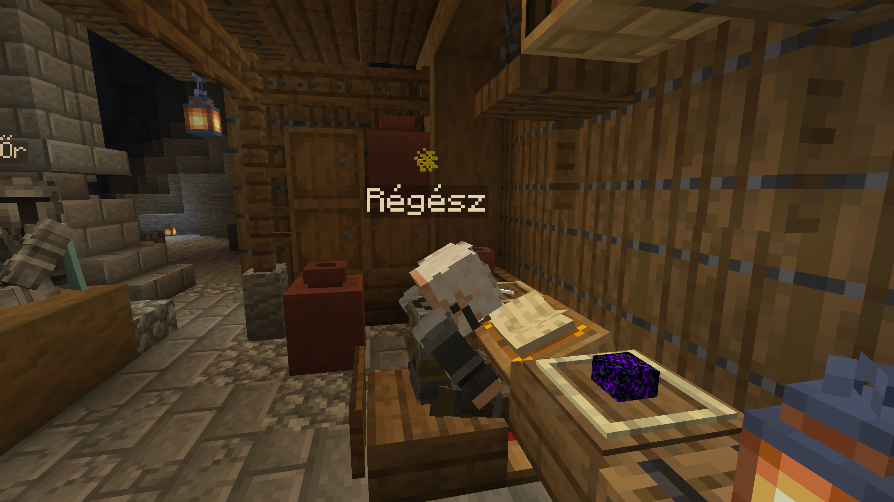
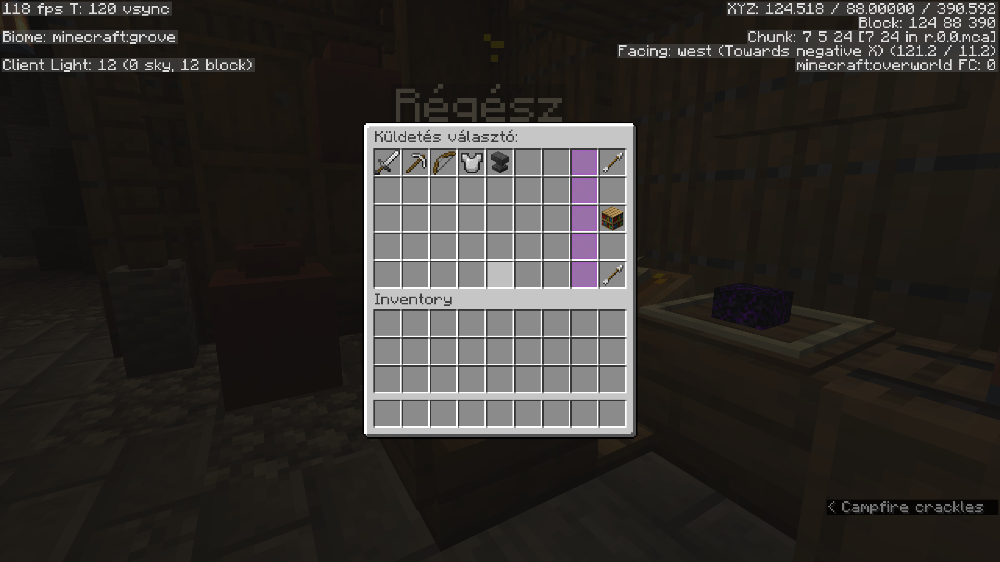
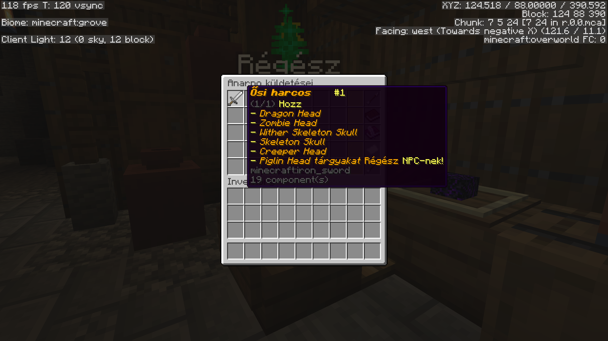

# Megújultak az Ősi Mesterségek — Küldetésrendszer a Régésszel

Az ősi mesterségek rendszere átalakult! Mostantól a **Régész NPC-n** keresztül, **küldetések** teljesítésével szerezheted meg az ősi tudást. Ha elérted az Őrző rangot, látogass el az ősi romokhoz a főváros alatt!

<!-- more -->

## Mi változott?

Az ősi mesterségek megszerzése mostantól egy **küldetésrendszeren** keresztül történik. A korábbi rendszer helyett a **Régész NPC**-vel kell interakcióba lépned — **jobb klikkel** tudsz vele beszélni a főváros alatti feltárt ősi romoknál.

<figure markdown="span">
  { width="600" }
  <figcaption>A Régész az ősi romokban várja az Őrzőket</figcaption>
</figure>

---

## Hogyan működik az új rendszer?

A Régész **küldetéseket** kínál neked — minden ősi mesterséghez egy külön küldetés tartozik. A küldetés választó felületen kiválaszthatod, melyik mesterséget szeretnéd megszerezni.

<figure markdown="span">
  { width="600" }
  <figcaption>A Régész küldetés választó felülete — válaszd ki a kívánt mesterséget</figcaption>
</figure>

Miután kiválasztottál egy küldetést, a Régész megmutatja, **milyen tárgyakra vagy feltételekre** van szükség a mesterség megszerzéséhez. A szükséges tárgyakat **el kell vinned a Régésznek**, aki felhasználja azokat az ősi tudás átadásához.

<figure markdown="span">
  { width="600" }
  <figcaption>Az Ősi Harcos küldetés — a szükséges mob fejek listája</figcaption>
</figure>

!!! warning "Fontos"
    A Régésznek átadott tárgyak **elvesznek** — a Régész felhasználja őket! Minden megszerzési lista **egyszer használatos**, szóval gondold meg, mielőtt átadod a tárgyaidat.

---

## Új kihívás az Ősi Vadászoknak

Az Ősi Vadász mesterség feltételei bővültek: az Ender Sárkány és a Wither mellé bekerült az **Elder Guardian** is mint kötelezően megölendő szörny. Az Elder Guardianokat az **Ocean Monument**-ekben találod — monumentonként 3 darab spawnolja, és Mining Fatigue-ot adnak, szóval készülj fel alaposan!

---

## Összefoglaló

| Változás | Részletek |
|---|---|
| Új rendszer | Küldetésalapú, a Régész NPC-n keresztül |
| Interakció | Jobb klikk a Régészre az ősi romoknál |
| Tárgyak | A Régésznek kell átadni — **elvesznek** |
| Ősi Vadász | Új követelmény: **Elder Guardian** megölése |

!!! info "Már megszerzett címek"
    Aki **korábban már megszerzett** egy ősi mesterség címet, annak az **megmarad** — nem kell újra teljesíteni a küldetést. Az új küldetésrendszer **mától** lép életbe, és csak az ezután megszerzendő címekre vonatkozik. Ha már megszerezted a címet, **hagyd figyelmen kívül a hozzá tartozó küldetést** — a rendszer nem tudja elrejteni a régi rendszer által megszerzett címekhez tartozó küldetéseket.

A mesterségek feltételei és jutalmai nem változtak — csak a megszerzés módja lett más. A részletekért látogasd meg az [Ősi Bűvölés és Mesterségek](../../osi-mestersegek.md) oldalt!
