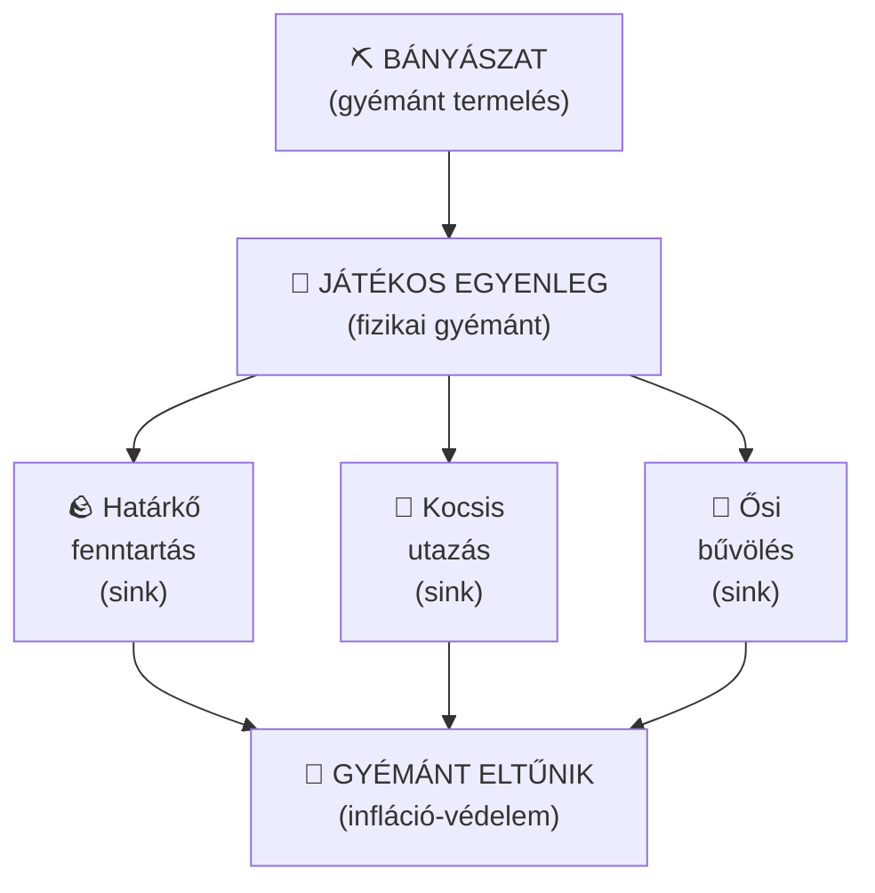

# Gazdasági rendszer

> *A birodalom valutája a gyémánt — nem virtuális szám, hanem igazi, kézzel bányászott érték.*

[← Vissza a főoldalra](index.md)

---

## Alapelvek

Az Újvilág gazdasági rendszere egyetlen egyszerű elvre épül: **a gyémánt a valuta.** Nem virtuális pénz, nem token, nem pont — hanem a fizikai gyémánt item, amit kézzel kell kibányásznod. Az árképzés alapegysége a **gyémántrög**, amelyből 9 darab ad ki egy gyémántot.

Ez a megoldás azt jelenti, hogy:
- **Nem farmolható automatikusan** — a gyémánt értékét a befektetett munka adja
- **Vannak sink-ek** (gyémánt-elnyelők) a rendszerben, így **nem lesz infláció**
- **Minden tranzakció valós** — amit fizetsz vagy kapsz, az tényleg a tárhelyeden jelenik meg
- **Pontos árképzés** — a gyémántrögnek köszönhetően 1 gyémántnál kisebb értékek is kifejezhetők

---

## Hogyan működik?

### Gyémánt mint valuta

Az economy plugin a gyémántot jelöli meg valutaként. Amikor fizetsz vagy neked fizetnek, a rendszer **automatikusan kezeli** a gyémántjaidat:

A rendszer automatikusan megtalálja a gyémántjaidat és a megfelelő helyre rakja a kapott gyémántokat. Természetesen **blokkosít** is — azaz 9 gyémánt automatikusan gyémánt blokká alakul a hatékonyabb tárolás érdekében.

### Gyémántrög — az árképzés alapegysége

A szerveren elérhető a **gyémántrög** ( ), amely ugyanúgy működik, mint az aranyrög az arany esetén. A gyémántrög lehetővé teszi a **törtértékű árképzést** — azaz olyan termékek és szolgáltatások árazását, amelyek kevesebbet érnek, mint 1 teljes gyémánt.

A gazdaság három fizikai tárgyat használ valutaként:

| Tárgy | Kép | Érték | Leírás |
|---|---|---|---|
| **Gyémántrög** |  | **1 rög** (alapegység) | A legkisebb címlet — az árképzés alapja |
| **Gyémánt** |  | **9 rög** | 9 gyémántrögből állítható össze |
| **Gyémánt blokk** |  | **81 rög** (9×9) | 9 gyémántból áll össze — a legnagyobb címlet |

#### Gyémánt craftolása gyémántrögből

Barkácsolás

<table class="crafting-grid">
<tr>
<td></td>
<td></td>
<td></td>
</tr>
<tr>
<td></td>
<td></td>
<td></td>
</tr>
<tr>
<td></td>
<td></td>
<td></td>
</tr>
</table>

**Recept:** 9 gyémántrög = 1 gyémánt

!!! tip "Miért gyémántrög?"
    A gyémántrög segítségével pontosabb árakat tudsz megadni a [ládaboltodban](piacter.md). Ha például egy termék 3 rögöt ér, azt eddig nem lehetett kifejezni — most viszont igen. Az árképzés alapja mindig a **gyémántrög**.

!!! info "Resource pack a gyémántrög megjelenítéséhez"
    Ahhoz, hogy a gyémántrög a játékban is helyesen jelenjen meg, töltsd le és használd a szerver resource packját: **[Resource pack letöltése](https://download.mc-packs.net/pack/e4ef1bff27bce59e15b183ea58186da4895e5f0c.zip)**

### Egyenleg és nyilvántartás

| Parancs | Funkció |
|---|---|
| `/bal` | Saját gyémánt egyenleg megtekintése |
| `/baltop` | Leggazdagabb játékosok listája |
| `/pay összeg` | Gyémánt küldése másik játékosnak |
| `/sb` | Információs panel (egyenleg is látható rajta) |

---

## Mire megy el a gyémánt?

A gyémánt valuta értékét az tartja fenn, hogy **rendszeres kiadásaid vannak** (sink-ek):

### Rendszeres költségek

| Költség | Mennyiség | Gyakoriság | Részletek |
|---|---|---|---|
| [Határkő](hatarkovek.md) fenntartás | 1 gyémánt | 4 naponta | Rangtól függetlenül |
| [Kocsis](utazas.md#kocsis-rendszer) utazás | pár gyémánt | alkalmanként | Játékos-látogatás, megálló utazás |
| Kocsis megálló feloldás | gyémánt | egyszeri | 2., 3., 4. megálló feloldása |
| [Ősi bűvölés](osi-mestersegek.md) | változó | alkalmanként | Szintemelés egyre drágább |

### Bevételi lehetőségek

| Forrás | Hogyan |
|---|---|
| Bányászat | A klasszikus módszer — menj le és bányássz |
| [Ládabolt](piacter.md) eladás | Termelj és adj el a piactéren |
| Kereskedés | Alkudj más játékosokkal közvetlenül |
| Közösségi farmok | A közösség által épített farmok termékei értékesek lehetnek |

---

## Fontos tudnivalók

**Szerencse enchant és bányászat.** A gyémánt érc bányászása számít a [rangfeltételeknél](rangok.md), de ott az érc darabszám lényeges, nem a gyémánt — tehát a Szerencse enchant nem gyorsítja a rang előrehaladást. Viszont a valutagyűjtéshez a Szerencse nagyon hasznos, mert több gyémántot kapsz ércenként.

**Nincs gyémánt farm.** A szerver Paper-en fut, és a rendszer lényegéből adódóan automatikus gyémánt-termelés nem lehetséges. A gyémánt értéke a bányászatba fektetett munkából származik.

**A gazdaság játékos-vezérelt.** Nincsenek NPC boltok, nincsenek admin shopok. Az árak a kereslet-kínálat alapján alakulnak ki a játékosok [ládaboltjaiban](piacter.md).

---

## A gazdaság áttekintő diagramja

A rendszer tehát **zárt kör**: a gyémánt bányászattal jön létre, különféle szolgáltatások elnyelik, és ez tartja fenn az értékét. Nincs infláció, mert a sink-ek folyamatosan vonják ki a gyémántot a forgalomból.

---

[← Előző: Rangrendszer](rangok.md) | [→ Következő: Határkövek](hatarkovek.md)
