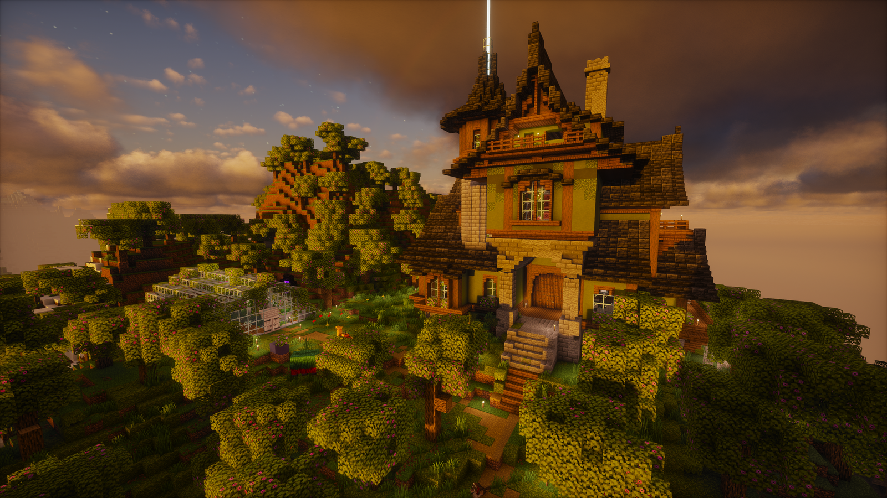
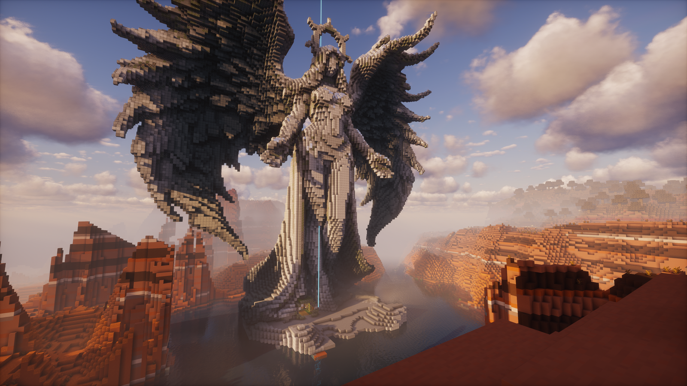
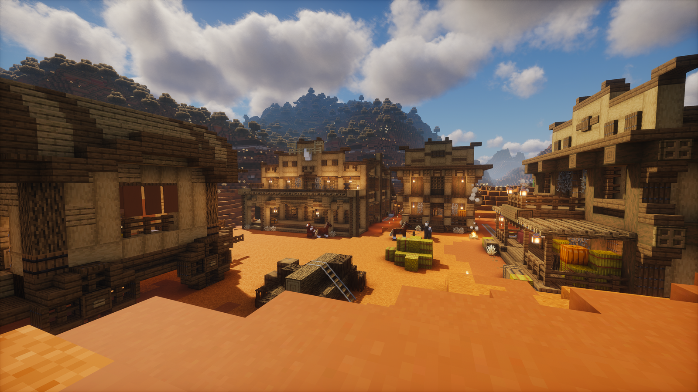
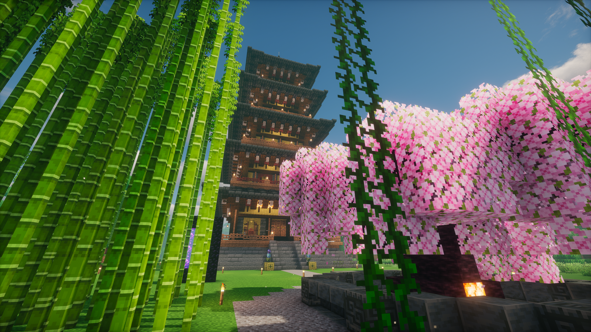
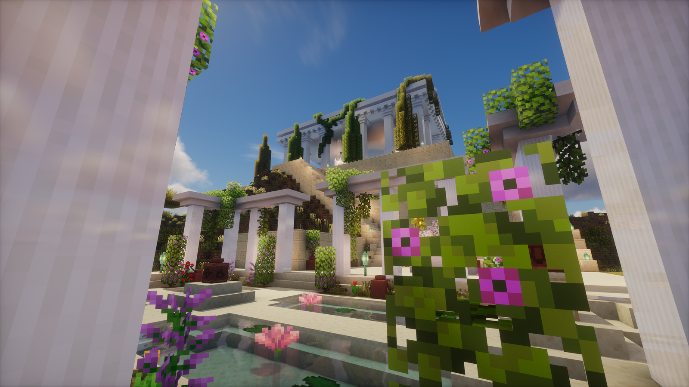
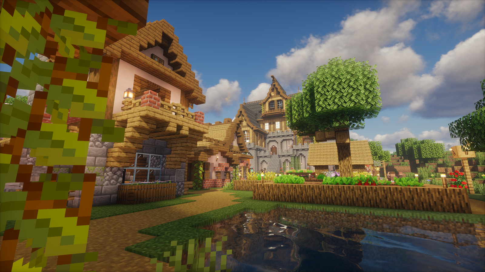
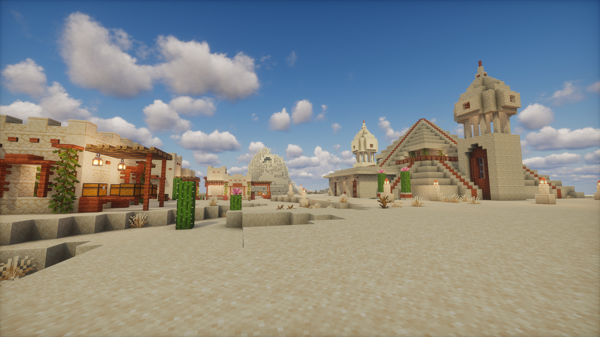

{ .hero-image }

# Újvilág Birodalom

### Békés, vanilla-közeli Minecraft — felnőtteknek, sietség nélkül.

Whitelistes **18+ Java szerver**, ahol a befektetett idő és a közösség számít.
Nincs pay-to-win, nincs PvP, nincs világtörlés — csak egy gondosan felépített
világ, ahol a **saját tempódban** építesz, kereskedsz és felfedezel.

[:fontawesome-brands-discord: Csatlakozz Discordon](https://discord.gg/MdBWZhAgCy){ .md-button .md-button--primary }
[:material-clipboard-check: Jelentkezz a whitelistre](https://forms.gle/h9J92S4DkaAJ87PA8){ .md-button }

---

!!! quote ""
    **Kis, de elkötelezett közösség.** Nem tömegszerver vagyunk — itt mindenki
    ismeri egymást, és a világ, amit látsz, kézzel épült. Ha egy nyugodt,
    barátságos helyet keresel a napi kapkodás helyett, jó helyen jársz.

---

## Mi teszi különlegessé az Újvilágot?

=== "Amit NEM találsz nálunk"

    - **Nincs pay-to-win** — pénzért semmit nem lehet venni
    - **Nincs PvP** — békés, PvE világ, egymás bántása tilos
    - **Nincs világtörlés** — amit felépítesz, az megmarad
    - **Nincs staff-kivételezés** — mindenkire ugyanaz a szabály
    - **Nincsenek OP pluginok** — se spawner-termelő, se automata pénzgép

=== "Amit nálunk megtalálsz"

    - **Fizikai gyémánt valuta** — kézzel bányászott, valódi érték
    - **Automatikus rangrendszer** — a játékod, nem a pénztárcád számít
    - **Határkövek** — olcsó, offline is működő területvédelem
    - **Közösségi piactér** — játékosok boltjai, valódi kereslet-kínálat
    - **Ősi bűvölés** — mély végjáték-tartalom a tapasztaltaknak

---

## Nézd meg, mit épített a közösség

-   

    **Szárnyas kolosszus** — óriásépítmény a kanyon felett. Nálunk van, aki idáig viszi.

-   

    **Vadnyugati város** — utcák, istállók, saloonok a badlandsben.

-   

    **Keleti pagoda** — cseresznyevirág és bambusz, többek közös munkája. Bármilyen stílusban építhetsz.

-   

    **Kertpalota** — oszlopsorok, függőkertek, tükröződő medencék. A részletek számítanak.

-   

    **Középkori falu** — otthonok és kertek egy vár árnyékában, a víz partján.

-   

    **Sivatagi város** — piramisok, tornyok, kaktuszok. Négy égtáj, négy világ.

---

!!! success "Aki marad, otthonra talál"
    Nálunk nem lemorzsolódsz — a szerveren maradó játékosok **túlnyomó
    többsége** eljut a legmagasabb, **Őrző** rangig. Kis közösség, mély
    elköteleződés: aki belép és megtetszik neki, az itt is marad.

---

## Gyors tények

| | |
|---|---|
| Weboldal | [ujvilag-birodalom](https://sites.google.com/view/ujvilag-birodalom/) |
| Discord | [discord.gg/MdBWZhAgCy](https://discord.gg/MdBWZhAgCy) |
| Jelentkezés (whitelist) | [Google Form](https://forms.gle/h9J92S4DkaAJ87PA8) |
| Szerver verzió | Java 1.21.11 |
| Elérhetőség | 0-24, folyamatos üzemelés |

## Hogyan csatlakozz?

1. **Lépj be a [Discordra](https://discord.gg/MdBWZhAgCy)** — itt éred el a közösséget és a segítséget.
2. **Töltsd ki a [jelentkezési űrlapot](https://forms.gle/h9J92S4DkaAJ87PA8)** — pár perc az egész.
3. **Várd meg a jóváhagyást**, majd csatlakozz és olvasd el a [Gyors indulást](gyors-indulas.md).

*A birodalom kapui nyitva állnak. Üdv, Vándor!*

---

## Wiki — a birodalom kézikönyve

| Oldal | Leírás |
|---|---|
| [Gyors indulás](gyors-indulas.md) | Kezdő útmutató és TODO lista az első lépésekhez |
| [Rangrendszer](rangok.md) | Vándor, Telepes, Úttörő, Őrző — követelmények és jogosultságok |
| [Gazdasági rendszer](gazdasag.md) | Gyémánt valuta, kereskedés, egyenleg |
| [Határkövek](hatarkovek.md) | Területvédelem, crafting, beállítások |
| [Utazás](utazas.md) | Főváros, fogadók, kocsis, játékos-látogatás |
| [Ládaboltok és Piactér](piacter.md) | Közösségi kereskedés, bolt létrehozás |
| [Ősi Bűvölés és Mesterségek](osi-mestersegek.md) | Végjáték tartalom: ősi címek és enchant rendszer |
| [Szabályzat](szabalyzat.md) | Szerver szabályok |
| [Parancsok](parancsok.md) | Teljes parancslista kategóriánként |
| [Szerver infó](szerver-info.md) | Technikai adatok, hosting, csatlakozás |
| [Közösségi tartalom](kozossegi/index.md) | Játékosok által beküldött farmok, útmutatók, építmények |

!!! tip "Hogyan használd a wikit?"
    Az oldalak egymásra hivatkoznak — ha egy szövegben kék linket látsz, az egy
    másik wiki oldalra vagy annak egy szekciójára vezet. Kezdőként a
    [Gyors indulás](gyors-indulas.md) oldalt ajánljuk, tapasztaltabb
    játékosoknak pedig az [Ősi Bűvölés](osi-mestersegek.md) nyújthat új
    felfedezni valót.
