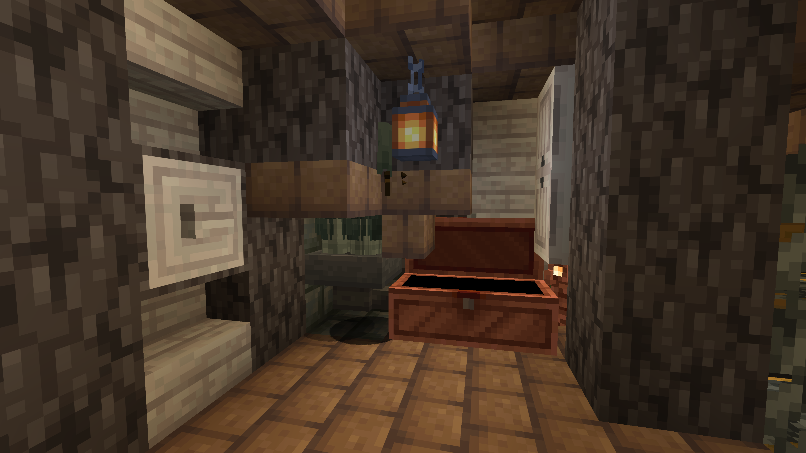
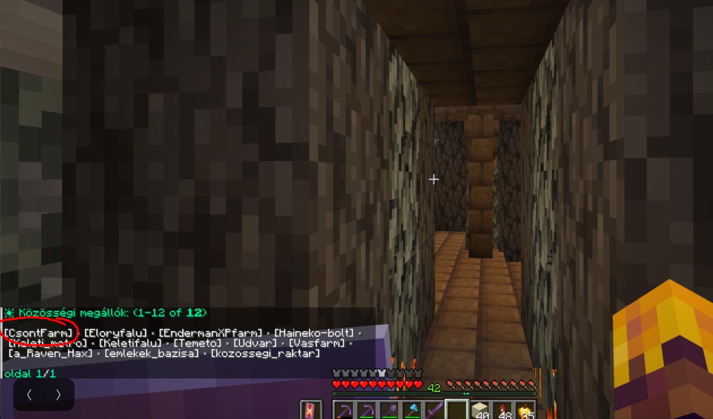
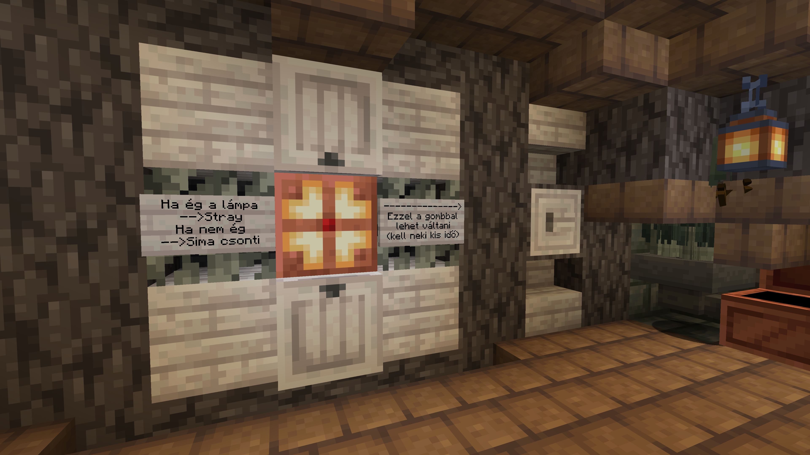
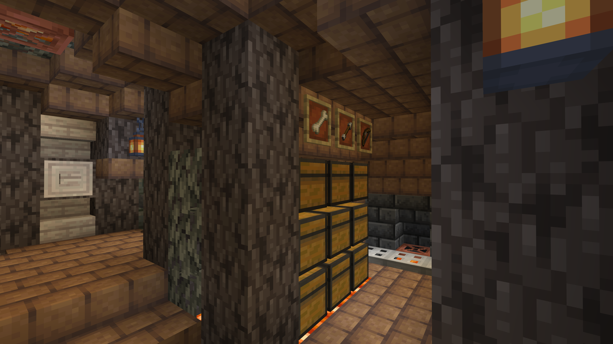

# Közösségi csont farm

> *Automatikus csontváz-spawner alapú farm.
Állítható stray/csontváz kapcsolóval.*

[← Vissza a közösségi oldalakhoz](index.md)

---

!!! info "Információ"
    - **Típus:** Farm
    - **Építő(k):** PoweredBySarcasm
    - **Koordináták:** - használd a közösségi kocsis megállót
    - **Dimenzió:** Overworld
    - **Hozzáadva:** 2026-07-28
    - **Beküldő:** @tnkarno

---

## Használat

1. Utazz el a /kozi parancs segítségével a CsontFarm megállóhoz.
2. Állj a farm területén és várj, amíg elindulnak a spawnerek.
3. Opcionális: kapcsold át a farmot stray/csontváz üzemmódba
4. Öld meg az összegyűlt csontvázakat.
5. Vedd ki a részedet a ládákból.

## Fontos tudnivalók

1. Ne rongjálj!
2. Soha ne üsd ki a spawnereket!
3. Ha más már ott van, gyere vissza később.

---

## Képek

{ loading=lazy }

{ loading=lazy }

{ loading=lazy }

{ loading=lazy }

