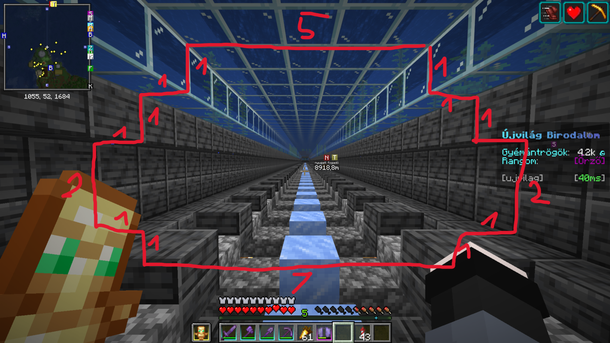
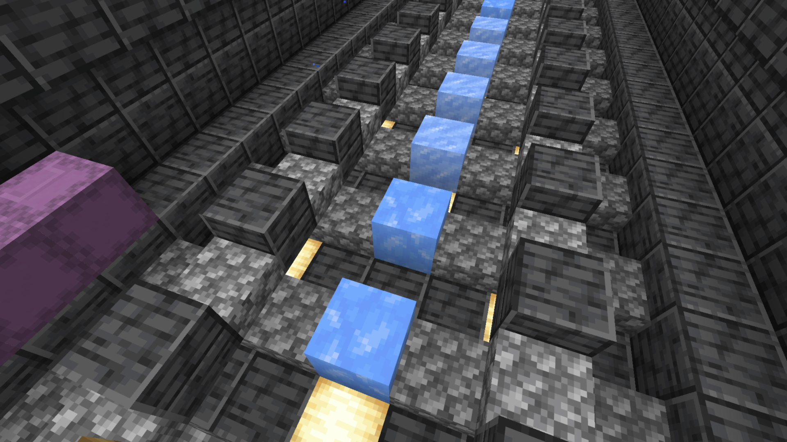
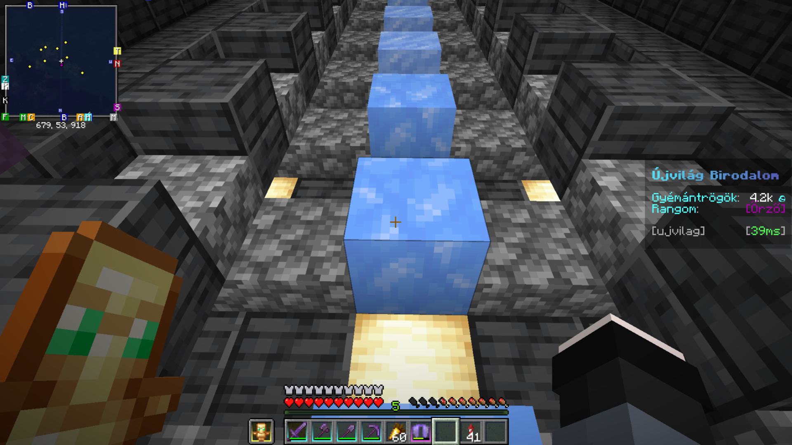
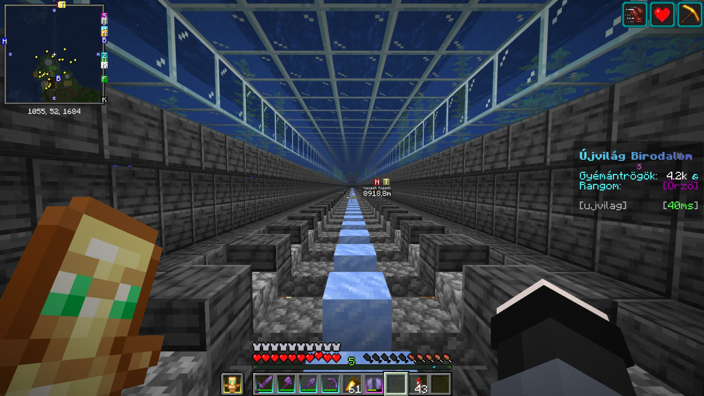

# Metró 

> *A metró több felé is elmegy. Szabadon használható.
Megállók:
Buksi112 bázisa
Elory6196 bázisa
kecskusz69 bázisa
Buksi112 vendég háza
Főváros
Totem farm
Mob farm*

[← Vissza a közösségi oldalakhoz](index.md)

---

!!! info "Információ"
    - **Típus:** Építmény
    - **Építő(k):** Buksi112, Burny, kecskusz69, Elory6169
    - **Dimenzió:** Overworld
    - **Hozzáadva:** 2026-06-18
    - **Beküldő:** @Buksi112

---

#Használata

A metrót TILOS rombolni vagy felrobbantani
A metrót két személy is tudja használni akár mert elférnek egymás mellett ketten is

#Építési útmutató

 
A jégre ha rá állsz akkor 52 szinten vagy (csak buksinál van 51 a bázisánnál de az hibás de müködik egy emelkedővel)
Az építést Buksi112 egyeztessétek le

---

## Képek

{ loading=lazy }

{ loading=lazy }

{ loading=lazy }

{ loading=lazy }

